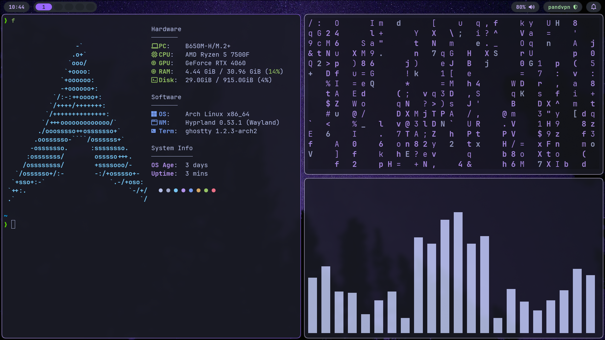
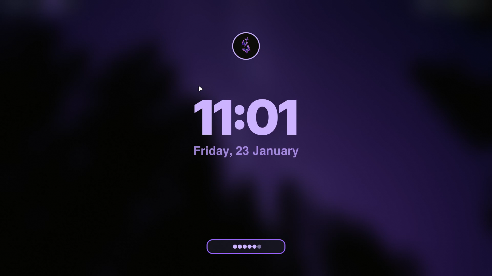
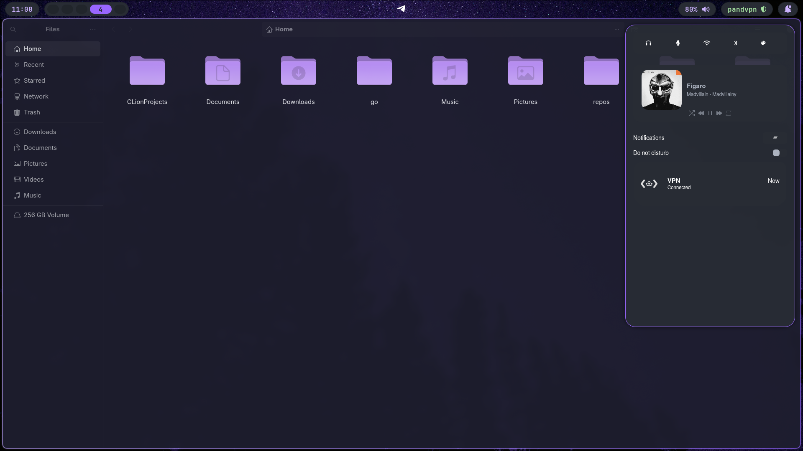
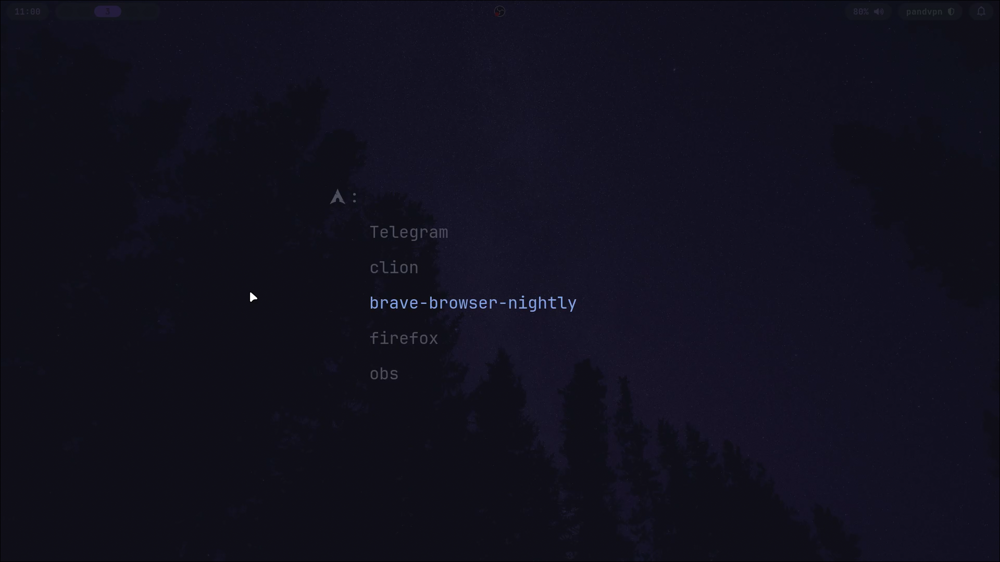

# Hyprdots

Minimal purple-themed Hyprland dotfiles with a quick install, a Tofi-powered screenshot helper (copy/save webp/png), and a Waybar VPN toggle.

<details>
<summary>Screenshots (click to expand)</summary>

| Preview | Notes                                   |
| --- |-----------------------------------------|
|  | terminal + fastfetch                    |
|  | hyprlock                                |
|  | Notification center + Waybar VPN toggle |
|  | tofi launcher                           |
|  | wlogout dialog                          |

</details>

## Dependencies

Required to match the configs:
- Core: `hyprland`, `waybar`, `swaync`, `tofi`, `wlogout`
- Daemons: `hyprpaper`, `hypridle`, `hyprlock`
- Tools: `ghostty`, `fastfetch`, `micro`, `jq`
- Audio/brightness: `pipewire`/`wireplumber`, `pavucontrol`, `wpctl`, `brightnessctl`, `playerctl`
- Screenshots: `grim`, `slurp`, `wl-clipboard`, `imagemagick`
- Networking: `wireguard-tools`, `iproute2`
- Notifications: `libnotify` (`notify-send`)
- Theming: GTK 3/4, `nwg-look`, `fontconfig`
- Themes/icons/cursor used in configs: Catppuccin GTK, Colloid icons, Bibata cursor
- Bootloader (optional): `refind`

Example (Arch-based distros):

```bash
sudo pacman -S hyprland waybar swaync hyprpaper hypridle hyprlock ghostty fastfetch micro jq pipewire wireplumber pavucontrol exa brightnessctl playerctl grim slurp wl-clipboard imagemagick wireguard-tools iproute2 libnotify nwg-look fontconfig ttf-jetbrains-mono-nerd zsh git
yay -S tofi wlogout fzf
chsh -s $(which zsh) # Change your shell to zsh
source ~/.zshrc
```

## Quick start

```bash
git clone https://github.com/dkorbelainen/hyprdots.git
cd hyprdots
chmod +x install.sh
./install.sh
```

What the scripts do:
- symlink repo configs into `~/.config` (hyprland, waybar, swaync, tofi, wlogout, ghostty, fastfetch, nwg-look, gtk3/gtk4, micro)
- link `.zshrc`, `.p10k.zsh`, `.gtkrc-2.0`

## Manual setup (not automated by scripts)

- Hyprpaper background: a sample `wallpaper.jpg` is included in `.config/hypr/wallpaper.jpg`. Replace with your file if desired.
- GTK theme/icon/cursor: install Catppuccin GTK, Colloid icons, and Bibata cursor yourself, then pick them in `nwg-look`.
- VPN widget: Waybar scripts assume interface name `pandvpn`; edit `~/.config/waybar/scripts/vpn-*.sh` to yours.
- Screenshot tool: `~/.config/hypr/hypr-screenshot` offers a Tofi menu to copy or save as webp/png into `~/Pictures/SS`. Ensure `grim`, `slurp`, `wl-clipboard`, `imagemagick`, and `tofi` are installed.
- Hyprlock avatar: replace `~/.config/hypr/avatar.png` (placeholder provided) with your own image if you want it shown on the lock screen.

## Licenses & attributions

- Repo configs/scripts: MIT (see `LICENSE`).
- Catppuccin themes/icons usage: under MIT.
- Wallpaper `.config/hypr/wallpaper.jpg`: photo by Joshua Woroniecki, Unsplash License https://unsplash.com/photos/the-night-sky-is-filled-with-stars-and-trees-1ByBY06L-Z0.
