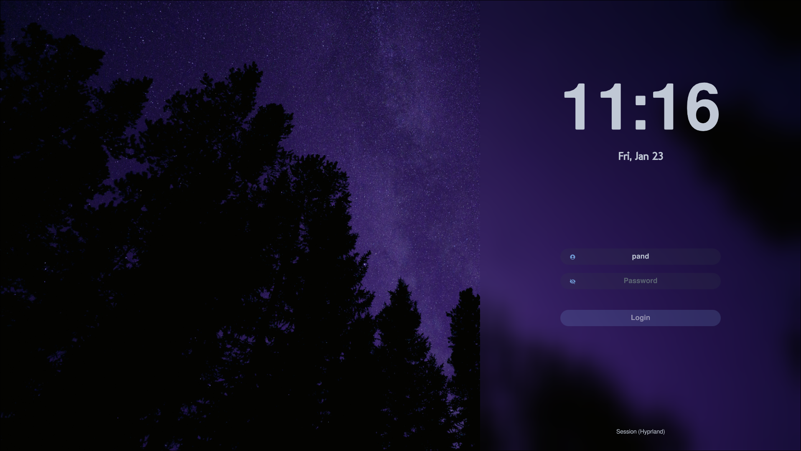

# Hyprdots

Minimal purple-themed Hyprland dotfiles with a quick install, a Tofi-powered screenshot helper (copy/save webp/png), and a Waybar VPN toggle.

<details>
<summary>Screenshots (click to expand)</summary>

| Preview | Notes                                   |
| --- |-----------------------------------------|
|  | terminal + fastfetch                    |
|  | hyprlock                                |
|  | SDDM theme                              |
|  | Notification center + Waybar VPN toggle |
|  | tofi launcher                           |
|  | wlogout dialog                          |

</details>

## Dependencies

Required to match the configs:
- Core: `hyprland`, `waybar`, `swaync`, `tofi`, `wlogout`
- Daemons: `hyprpaper`, `hypridle`, `hyprlock`
- Tools: `ghostty`, `fastfetch`, `micro`, `jq`
- Audio/brightness: `pipewire`/`wireplumber`, `pavucontrol`, `wpctl`, `brightnessctl`, `playerctl`
- Screenshots: `grim`, `slurp`, `wl-clipboard`, `imagemagick`
- Networking: `wireguard-tools`, `iproute2`
- Notifications: `libnotify` (`notify-send`)
- Theming: GTK 3/4, `nwg-look`, `fontconfig`, SDDM
- Themes/icons/cursor used in configs: Catppuccin GTK, Colloid icons, Bibata cursor
- Bootloader (optional): `refind`

Example (Arch-based distros):

```bash
sudo pacman -S hyprland waybar swaync hyprpaper hypridle hyprlock ghostty fastfetch micro jq pipewire wireplumber pavucontrol exa brightnessctl playerctl grim slurp wl-clipboard imagemagick wireguard-tools iproute2 libnotify nwg-look sddm fontconfig ttf-jetbrains-mono-nerd zsh git
yay -S tofi wlogout fzf
chsh -s $(which zsh) # Change your shell to zsh
source ~/.zshrc
```

## Quick start

```bash
git clone https://github.com/dkorbelainen/hyprdots.git
cd hyprdots
chmod +x install.sh install-sddm.sh
./install.sh --sddm   # drop --sddm if you only want user configs
```

What the scripts do:
- symlink repo configs into `~/.config` (hyprland, waybar, swaync, tofi, wlogout, ghostty, fastfetch, nwg-look, gtk3/gtk4, micro)
- link `.zshrc`, `.p10k.zsh`, `.gtkrc-2.0`
- with `--sddm`, call `install-sddm.sh` as root to install the theme, fonts, and `/etc/sddm.conf`

## rEFInd

rEFInd is a boot manager; it makes selecting between multiple OSes/kernels easy without fiddling with bootloader configs each time.

- Config: `boot/EFI/refind/refind.conf` includes Catppuccin themes.
- Theme is bundled under `boot/EFI/refind/themes/catppuccin/` (from Catppuccin rEFInd).
- Install steps (example):
  ```bash
  sudo mount /dev/<EFI_PARTITION> /boot/EFI   # ensure EFI is mounted
  sudo EFI_ROOT=/boot/EFI ./install-refind.sh
  ```
- After copying, tweak `default_selection` to your kernel label and `scanfor`/`timeout` as you like.

## Manual setup (not automated by scripts)

- SDDM/Hyprpaper backgrounds: a sample `wallpaper.jpg` is included and set in `sddm/themes/vitreous/vitreous.conf` under `Backgrounds/`. Replace with your file if desired.
- GTK theme/icon/cursor: install Catppuccin GTK, Colloid icons, and Bibata cursor yourself, then pick them in `nwg-look`.
- VPN widget: Waybar scripts assume interface name `pandvpn`; edit `~/.config/waybar/scripts/vpn-*.sh` to yours.
- Screenshot tool: `~/.config/hypr/hypr-screenshot` offers a Tofi menu to copy or save as webp/png into `~/Pictures/SS`. Ensure `grim`, `slurp`, `wl-clipboard`, `imagemagick`, and `tofi` are installed.
- Hyprlock avatar: replace `~/.config/hypr/avatar.png` (placeholder provided) with your own image if you want it shown on the lock screen.
- Optional app binds: remove or remap keybinds for `spotify`, `Telegram`, `obsidian` if unused.

## Licenses & attributions

- Repo configs/scripts: MIT (see `LICENSE`).
- Catppuccin themes/icons usage: under MIT.
- SDDM theme `vitreous`: by sane1090x, GPL-3.0 (see header in `sddm/themes/vitreous/vitreous.conf`).
- Wallpaper `sddm/themes/vitreous/Backgrounds/wallpaper.jpg`: photo by Joshua Woroniecki, Unsplash License https://unsplash.com/photos/the-night-sky-is-filled-with-stars-and-trees-1ByBY06L-Z0.
- Fonts bundled for SDDM (see `sddm/fonts/ATTRIBUTION.txt`):
  - Google Sans Text: SIL Open Font License 1.1 (free/open for use & redistribution).
  - Neue Machina (Pangram Pangram): free for non-commercial use only.
  - London Between (Pangram Pangram): free for non-commercial use only.
